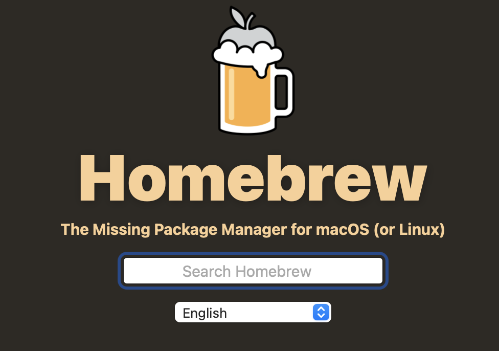
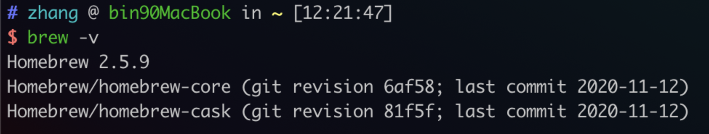

# Mac Brew 使用

## 介绍



> Homebrew installs [the stuff you need](https://formulae.brew.sh/formula/) that Apple (or your Linux system) didn’t.

官网：https://brew.sh

## 安装

`/bin/bash -c "$(curl -fsSL https://raw.githubusercontent.com/Homebrew/install/HEAD/install.sh)"`

一般情况下行不通。

参考 [知乎文章](https://zhuanlan.zhihu.com/p/111014448) 自动脚本进行安装

>
>
>`/bin/zsh -c "$(curl -fsSL https://gitee.com/cunkai/HomebrewCN/raw/master/Homebrew.sh)"`

会进行一些设置提醒。

**注意**： 这里要安装好git 并且网络通畅

`brew -v` 查看版本



## 常用命令


```bash
zhang @ bin90MacBook in ~ 
$ brew
Example usage:
  brew search [TEXT|/REGEX/] 查找包
  brew info [FORMULA...]     查看包的信息
  brew install FORMULA...    安装
  brew update                更新
  brew upgrade [FORMULA...]  升级
  brew uninstall FORMULA...  卸载
  brew list [FORMULA...]     查看安装列表

Troubleshooting:
  brew config
  brew doctor
  brew install --verbose --debug FORMULA

Contributing:
  brew create [URL [--no-fetch]]
  brew edit [FORMULA...]

Further help:
  brew commands
  brew help [COMMAND]
  man brew
  https://docs.brew.sh
```


## 服务管理

在brew安装的服务，都会通过`brew services`管理

首先 命令太长了 起个别名吧 

```bash
alias brsvs="brew services"
```

命令

```bash
brew services list
brew services stop svs
brew services stop
```

```bash
$ brew services list
Name   Status  User Plist
consul stopped
mysql  stopped
nginx  stopped
redis  stopped
```

完结