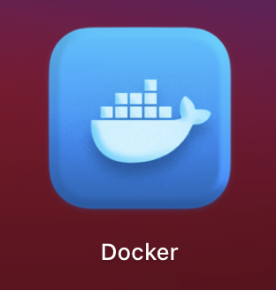

# Docker

## What？是什么

Docker是一个**虚拟环境容器**

### Docker的三个概念

1. 镜像（Image）：类似于虚拟机中的镜像，是一个包含有文件系统的面向Docker引擎的只读模板。任何应用程序运行都需要环境，而镜像就是用来提供这种运行环境的。例如一个Ubuntu镜像就是一个包含Ubuntu操作系统环境的模板，同理在该镜像上装上Apache软件，就可以称为Apache镜像。
2. 容器（Container）：类似于一个轻量级的沙盒，可以将其看作一个极简的Linux系统环境（包括root权限、进程空间、用户空间和网络空间等），以及运行在其中的应用程序。Docker引擎利用容器来运行、隔离各个应用。容器是镜像创建的应用实例，可以创建、启动、停止、删除容器，各个容器之间是是相互隔离的，互不影响。注意：镜像本身是只读的，容器从镜像启动时，Docker在镜像的上层创建一个可写层，镜像本身不变。
3. 仓库（Repository）：类似于代码仓库，这里是镜像仓库，是Docker用来集中存放镜像文件的地方。注意与注册服务器（Registry）的区别：注册服务器是存放仓库的地方，一般会有多个仓库；而仓库是存放镜像的地方，一般每个仓库存放一类镜像，每个镜像利用tag进行区分，比如Ubuntu仓库存放有多个版本（18.04、20.04等）的Ubuntu镜像。

## Why? 为什么

可以将你的开发环境、代码、配置文件等一并打包到这个容器中，并发布和应用到任意平台中。

## How？怎么用

`systemctl start docker` 开启docker服务
`systemctl stop docker` 停止docker服务
`docker pull name:tag`  获取镜像
`docker run --name -p port:port -d imagename`
`docker stop $CONTAINER_ID` 停止容器
`docker start $CONTAINER_ID`终止状态的容器，可以使用docker start来重新启动。
`docker restart $CONTAINER_ID` 重启容器
`docker attach $CONTAINER_ID`连接上容器实时查看
`docker rm `删除容器
`docker ps` 运行容器的状态
`docker ps -a` 所有容器的状态
`docker ps | grep mysql` 查找相关容器的状态 
`docker exec -it NAME bash` 进入容器
`docker attach` 进入容器 ctl+p+q 退出 [过时了]
`docker rm $(docker ps -a -q)` 删除所有停止容器
`docker search IMAGE_NAME` 查找镜像
`docker images` 查看镜像
`docker rmi ` 删除镜像
`docker logs $CONTAINER_ID` 查看日志