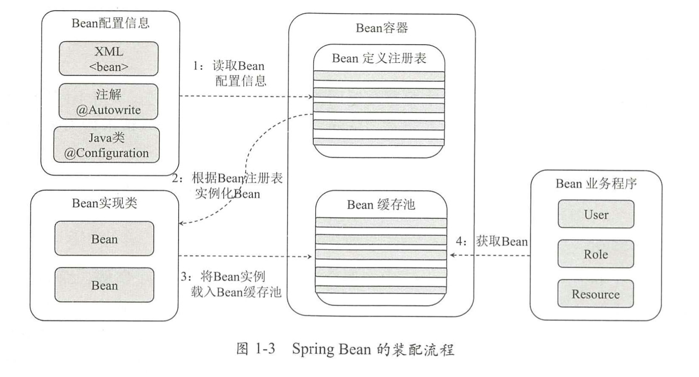
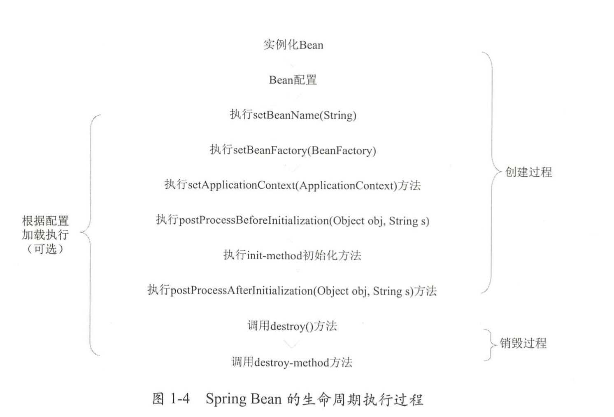
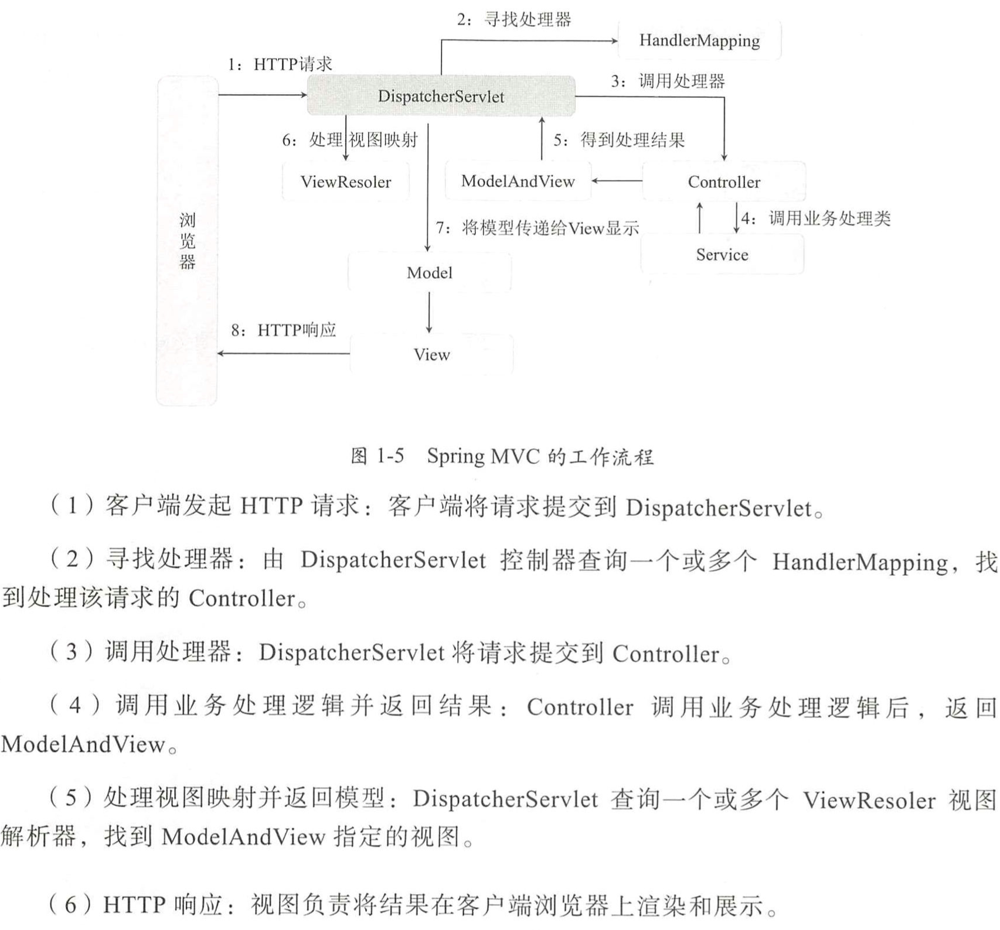
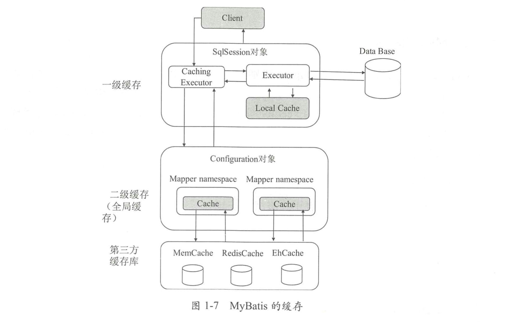
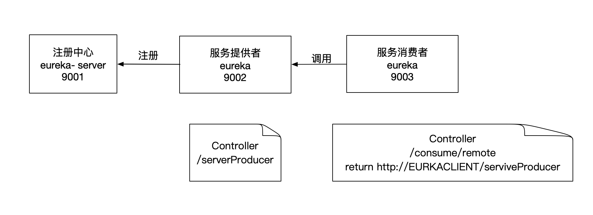
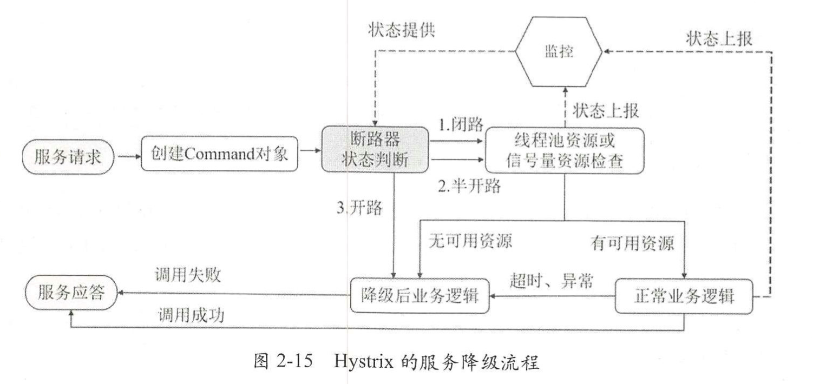

### Bean装配过程

Spring 在启动时会从 XML 配 置文件或注解 中读取应用程序提供的 Bean 配置信息，并在 Spring 容器中生成一份相应的 Bean 配置注册表;然后根据这张注册表实例化 Bean,装配好 Bean 之间的依赖关系.为上层业务提供基础的运行环境 。 其中Bean缓存池HashMap 实现 。 Spring Bean 的装配流程如图 1-3 所示 。



### Bean 生命周期图



### SpringMVC 工作流程



### Spring AOP 应用场景

- Authentication 权限统一管理和授权

- Caching 缓存统一维护

- Context Passing 内容传递

- Error Handling 系统统一错误处理

- Lazy Loading 数据懒加载

- Debugging 系统调试

- Logging 日志记录与存储

- Performance Optimization 性能优化

- Resource Polling 资源池统一管理和申请

- Synchronization 操作同步

- Transaction 统一事务管理

  

### AOP 的两种代理方式

JDK动态代理：	- > 目标类接口

CGLiB动态代理：- > 其他 

(Code Generation Library)

### Mybatis缓存

MyBatis的缓存分为一级缓存和二级缓存，如下图，默认情况下，一级缓存是开启的，而且不能被关闭。



**一级缓存：**是指SqlSession级别的缓存，当在同一个SqlSession中执行相同的SQL语句查询时将其查询结果缓存，第二次查询不会从数据库中查询，而是直接从缓存中取，一级缓存最多能缓存1024条SQL语句。

**二级缓存：**是指跨SqlSession的缓存，是Mapper级别的缓存。在Mapper级别的缓存内，不同的SqlSession缓存可以共享。

#### 原理：

##### 一级缓存原理：

缓存中使用的数据结构是**Map**：其中key为 MapperId + Offset + Limit + SQL <br>
当同一个SqlSession多次发出相同的SQL查询语句时，MyBatis直接从缓存中取数据。但是如果两次查询中，如果出现commit(update,insert,delete)操作，则认为数据发生了变化，MyBatis会把该SqlSession中的一级缓存区域全部清空，当下次再到缓存中查找数据时找不到对应的缓存数据，因此，下次再从数据库中查询数据并将查询结果写入缓存。
##### 二级缓存原理：
二级缓存是Mapper级别的，Mapper以命名空间为单位创建缓存数据结构，数据结构为Map，其中key为 MapperId + Offset + Limit + SQL <br>
实现：**CacheExecutor**
配置：
 - Mybatis启动二级缓存配置
 - 对应的Mapper.xml配置cache节点
 - 对应的select查询节点中添加`useCache = true`

### Spring Cloud
Spring Cloud以组件化的形式提供了配置管理、服务发现、断路器、智能路由、负载均衡和消息总线的模块。
### Spring Boot
```xml
<?xml version="1.0" encoding="UTF-8"?>
<project xmlns="http://maven.apache.org/POM/4.0.0" xmlns:xsi="http://www.w3.org/2001/XMLSchema-instance"
	xsi:schemaLocation="http://maven.apache.org/POM/4.0.0 https://maven.apache.org/xsd/maven-4.0.0.xsd">
	<modelVersion>4.0.0</modelVersion>
	<!--定义Springboot项目-->
	<parent>
		<groupId>org.springframework.boot</groupId>
		<artifactId>spring-boot-starter-parent</artifactId>
		<version>2.4.0</version>
		<relativePath/> <!-- lookup parent from repository -->
	</parent>
  <!--项目id-->
	<groupId>com.bin90</groupId>
	<artifactId>demo</artifactId>
	<version>0.0.1-SNAPSHOT</version>
	<name>demo</name>
	<description>Demo project for Spring Boot</description>
	<!--java版本 -->
	<properties>
		<java.version>15</java.version>
	</properties>
	<!--依赖管理 -->
	<dependencies>
		<dependency>
			<groupId>org.springframework.boot</groupId>
			<artifactId>spring-boot-starter-web</artifactId>
		</dependency>
		
		<dependency>
			<groupId>org.springframework.boot</groupId>
			<artifactId>spring-boot-starter-test</artifactId>
			<scope>test</scope>
			<exclusions>
				<exclusion>
					<groupId>org.junit.vintage</groupId>
					<artifactId>junit-vintage-engine</artifactId>
				</exclusion>
			</exclusions>
		</dependency>
    
		<dependency>
			<groupId>junit</groupId>
			<artifactId>junit</artifactId>
			<version>4.12</version>
			<scope>test</scope>
		</dependency>
	</dependencies>

	<build>
		<plugins>
      <!--打包组件-->
			<plugin>
				<groupId>org.springframework.boot</groupId>
				<artifactId>spring-boot-maven-plugin</artifactId>
			</plugin>
      
			<plugin>
				<groupId>org.apache.maven.plugins</groupId>
				<artifactId>maven-compiler-plugin</artifactId>
				<configuration>
					<source>14</source>
					<target>14</target>
				</configuration>
			</plugin>
		</plugins>
	</build>

</project>

```

Euraka



#### Spring Cloud Feign

Feign是一个声明式、模版化的HTTP Client。目标是编写Java HTTP Client变得更简单。

Feign基于注解的方式将HTTP请求模版化。

#### Spring Cloud Hystrix

提供一套服务隔离、服务熔断、服务降级的解决方案。

##### 服务降级流程

