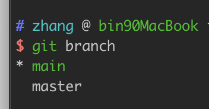
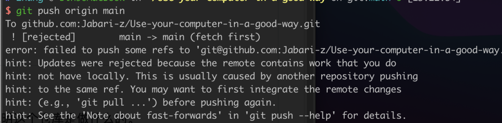

# Git

> Git is a free and open source distributed version control system designed to handle everything from small to very large projects with speed and efficiency.

## 一、本地使用
### 配置用户名邮箱

```
git config --user.name "RuphiLau"
git config --user.email "rf126@qq.com"
```

### 创建仓库 
`git init`
>会出现一个默认文件夹 `.git` 可以通过`ls -a` 查看
### 添加文件 
`git add <file>` 
### 查看状态
`git statue`

### 提交
`git commit -m "提交信息"`


## 二、链接GitHub
[GItHub Doc](https://docs.github.com/en/free-pro-team@latest/github/authenticating-to-github/connecting-to-github-with-ssh)

> # Connecting to GitHub with SSH
>
> 
>
> You can connect to GitHub using SSH.
>
> [About SSH→](https://docs.github.com/en/free-pro-team@latest/github/authenticating-to-github/about-ssh)
>
> Using the SSH protocol, you can connect and authenticate to remote servers and services. With SSH keys, you can connect to GitHub without supplying your username and personal access token at each visit.
>
> [Checking for existing SSH keys→](https://docs.github.com/en/free-pro-team@latest/github/authenticating-to-github/checking-for-existing-ssh-keys)
>
> Before you generate an SSH key, you can check to see if you have any existing SSH keys.
>
> [Generating a new SSH key and adding it to the ssh-agent→](https://docs.github.com/en/free-pro-team@latest/github/authenticating-to-github/generating-a-new-ssh-key-and-adding-it-to-the-ssh-agent)
>
> After you've checked for existing SSH keys, you can generate a new SSH key to use for authentication, then add it to the ssh-agent.
>
> [Adding a new SSH key to your GitHub account→](https://docs.github.com/en/free-pro-team@latest/github/authenticating-to-github/adding-a-new-ssh-key-to-your-github-account)
>
> To configure your GitHub account to use your new (or existing) SSH key, you'll also need to add it to your GitHub account.
>
> [Testing your SSH connection→](https://docs.github.com/en/free-pro-team@latest/github/authenticating-to-github/testing-your-ssh-connection)
>
> After you've set up your SSH key and added it to your GitHub account, you can test your connection.
>
> [Working with SSH key passphrases→](https://docs.github.com/en/free-pro-team@latest/github/authenticating-to-github/working-with-ssh-key-passphrases)
>
> You can secure your SSH keys and configure an authentication agent so that you won't have to reenter your passphrase every time you use your SSH keys.

## 三、本地+GIthub 同步

### 1 克隆仓库

`git clone git@github.com:xxx/xxx.git`

### 2 本地已有仓库 GitHub也有仓库 实现同步

`git remote add origin git@github.com:xxx/xxx.git`

### 3 推送

`git push -u origin master`

### 4 分支管理

- 列出分支：`git branch`

- 创建分支：`git branch <branchname>`

- 切换分支：`git checkout <branchname>` 

  - `git checkout -b <branchname>` 相当于下面两条
    - `git branch <branchname>`
    - `git checkout <branchname>`

- 合并分支：`git merge <branchname>` 将(branchname)分支合并到当前分支

- 删除分支：`git branch -d (branchname)`

  

  

带星号*的是当前分支

## 四、总结

```text
git init
git add .  # 添加所有改动的文件到仓库
git commit 文件路径 -m'fix:修复xx bug'

# github上已经有main分支 和dev分支在本地
git checkout -b dev # 创建+切换分支dev
git pull origin dev # 本地分支与远程分支相关联dev

# github无dev分支，在本地新建分支并推送到远程
git checkout -b dev
git push origin dev:dev  # 这样远程仓库中也就创建了一个dev分支

git branch  # 查看本地有多少分支
git branch 分支名字 # 创建分支
git checkout dev # 切换到dev分支进行开发
git push # 提交到远程
git branch -d dev # 删除本地dev分支
git merge dev # 合并dev到当前分支(master)
```

### 遇到的错误



>`$ git push origin master`
>只有当你有所克隆服务器的写入权限，并且之前没有人推送过时，这条命令才能生效。 当你和其他人在同一时间克隆，他们先推送到上游然后你再推送到上游，你的推送就会毫无疑问地被拒绝。 你必须先将他们的工作拉取下来并将其合并进你的工作后才能推送。

## 参考

[学习Git（一）起步](https://zhangslob.github.io/2018/03/14/%E5%AD%A6%E4%B9%A0Git%EF%BC%88%E4%B8%80%EF%BC%89%E8%B5%B7%E6%AD%A5/)

[学习Git（二）基本操作](https://zhuanlan.zhihu.com/p/34722119)

[dingzx97 - Github](https://github.com/dingzx97/use-computer-correctly/blob/main/Windows/如何做一个安静的github仓库管理者.md)

