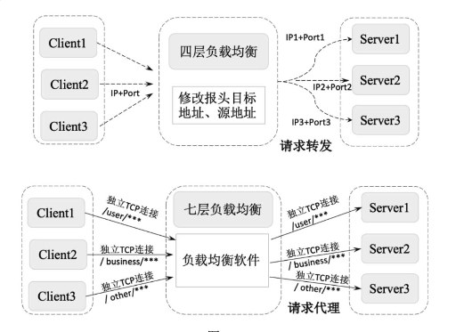
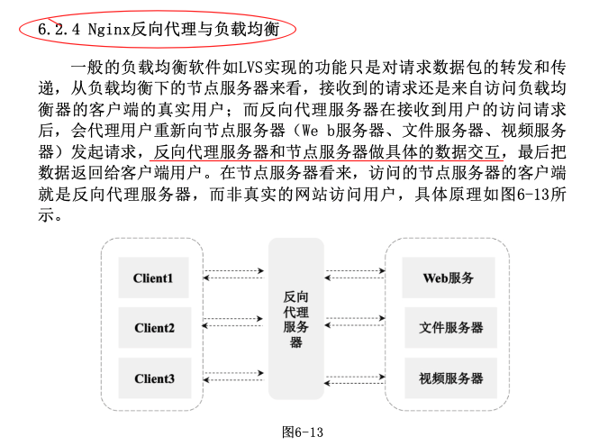

# 负载均衡

提供了一种廉价、有效、透明的方法来扩展网络设备和服务器的宽带，增加了吞吐量，加强了网络数据处理能力，提高了网络的灵活性和可用性。

常用的负载均衡有

- 四层负载均衡 ---- 只能对IP+端口的方式实现网络的负载均衡

  -  F5： 硬件负载均衡器，功能完备，价格昂贵
  - LVS： 软件，常和Keepalive配合使用
  - **Nginx** 同时实现四层负载和七层负载均衡，带缓存功能，可基于正则表达式灵活转发

- 七层负载均衡 ---- 能对消息的内容做更加有针对性的负载均衡

  - HAproxy
  - Nginx
  - Apache

  

负载均衡算法：

- 轮询均衡

- 权重轮询均衡

- 随机均衡

- 权重随机均衡

- 响应速度均衡

- 最少连接数均衡

- 处理能力均衡

- DNS响应均衡

- 散列算法均衡

- IP地址均衡

- URL均衡

  

  ##  Nginx

  https://www.nginx.cn/doc/ 中文文档

  [8分钟带你深入浅出搞懂Nginx](https://zhuanlan.zhihu.com/p/34943332)

  [连前端都看得懂的《Nginx 入门指南》](https://juejin.cn/post/6844904129987526663)



[运行nginx](https://www.nginx.cn/nginxchscommandline)

#### 启动

启动 Nginx：

```
sudo nginx` 或 `sudo brew services start nginx
```

停止 Nginx：

```
sudo nginx -s stop` 或 `sudo brew services stop nginx
```

热重启 Nginx：

```
sudo nginx -s reload
```

强制停止 Nginx：

```
sudo pkill -9 nginx
```

#### 修改配置

经常要用到的几个文件路径：

1. `/usr/local/etc/nginx/nginx.conf` （nginx配置文件路径）
2. `/usr/local/var/www` （nginx服务器默认的根目录）
3. `/usr/local/Cellar/nginx/1.17.9` （nginx的安装路径）
4. `/usr/local/var/log/nginx/error.log` (nginx默认的日志路径)


